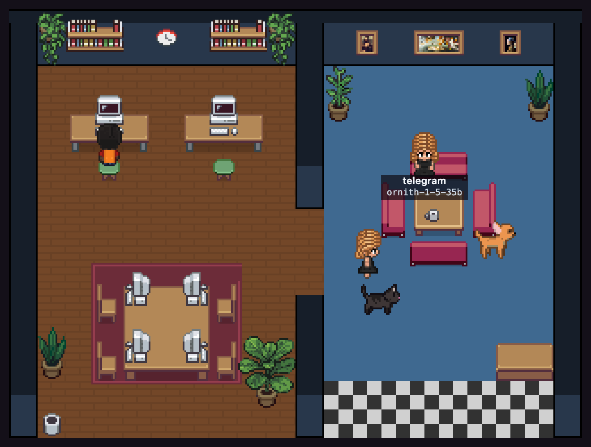

<div align="center">

# Visual Office for Hermes

**ห้องทำงานพิกเซลที่รู้ว่าตัวละครแต่ละตัวใช้โมเดลของใคร — และให้คุณสั่งได้ว่าโต๊ะไหนใช้โมเดลอะไร**

ทุก session และทุก subagent ของ [Hermes Agent](https://github.com/NousResearch/hermes-agent)
กลายเป็นตัวละครนั่งโต๊ะ · แต่ละโต๊ะผูกกับโมเดลของตัวเอง
งานที่ส่งไปโต๊ะไหน ก็วิ่งด้วยโมเดลของโต๊ะนั้น

**[วิธีใช้](docs/USAGE.md)** · **[สถาปัตยกรรม](docs/ARCHITECTURE.md)** · **[รายชื่อโต๊ะ](docs/DESKS.md)** · **[LiteGate — ประตูเดียวหน้า GPU](https://github.com/neronain/AiGatewayLocal)**

สร้างและดูแลโดย **neronain** — [facebook.com/neronain.minidev](https://www.facebook.com/neronain.minidev)

MIT — fork และต่อยอดเชิงพาณิชย์ได้ แต่ประกาศลิขสิทธิ์ต้องอยู่ · ดู [LICENSE](LICENSE) และ [NOTICE](NOTICE)



<sub>ภาพจากระบบที่รันอยู่จริง ไม่ใช่ภาพจำลอง · ตัวละครที่เห็นกำลังทำงานด้วย <code>ornith-1-5-35b</code></sub>

</div>

---

## ปัญหาที่ตัวนี้แก้

มีคนทำห้องพิกเซลให้ Hermes อยู่แล้ว — [`teknium1/hermes-pixel-office`](https://github.com/teknium1/hermes-pixel-office)
และ [`aiunlocked1412/hermes-agent-pixel`](https://github.com/aiunlocked1412/hermes-agent-pixel)
ทั้งสองตัวทำงานได้ดีในสิ่งที่ตั้งใจ แต่ทั้งสองตัวมองไม่เห็นสิ่งเดียวกัน:

> **ตัวละครทุกตัวหน้าเหมือนกันหมด** ทั้งที่ตัวหนึ่งอาจกำลังเผาเงินคลาวด์
> อีกตัวใช้ GPU ในตึกที่จ่ายไปแล้ว · และ **คุณเลือกไม่ได้ว่าลูกน้องตัวไหนใช้สมองตัวไหน**
> เพราะ `delegation.model` ใน Hermes เป็นค่าเดียวสำหรับลูกทุกตัว

ตัวนี้เติมสองอย่างนั้น

| | |
|---|---|
| 🪑 **โต๊ะผูกกับโมเดล** | เครื่องมือ `office_delegate` ส่งงานไป *ชื่อโต๊ะ* ไม่ใช่ลูกน้องนิรนาม · ลูกที่เกิดมาถูกปักหมุดไว้กับโมเดลของโต๊ะนั้น ผ่าน subagent lifecycle API ที่ Hermes เปิดไว้ให้ปลั๊กอินอย่างเป็นทางการ |
| 📊 **มิติโมเดลบนตัวละคร** | hook `post_api_request` ให้ทั้ง `model`, `provider`, `base_url` และ `usage` มาทุกครั้งที่เรียก · ป้ายชื่อโต๊ะจึงมีชื่อโมเดลเป็นสีตามแหล่ง (เขียว = GPU เรา · เหลือง = คลาวด์) จอบนโต๊ะติดเฉพาะตอนโต๊ะนั้นทำงาน และมีตัวนับโทเคนรายโต๊ะ |
| 💬 **สั่งงานและอ่านคำตอบบนหน้าเว็บ** | ช่องสั่งงานในแผงขวา เลือกโต๊ะแล้วพิมพ์ · คำตอบขึ้นบนหน้าเดียวกัน ไม่ต้องเปิดแชทคู่ไว้ · โต๊ะที่ยิงตรงตอบภายในไม่กี่วินาที |
| 🚨 **"รอคุณอยู่" อยู่บนสุด** | สถานะเดียวที่ไม่มีอะไรเดินต่อจนกว่าคนจะลงมือ · กล่องแดงบนสุดของแถบบอกว่าใคร รออะไร รอมานานแค่ไหน และหายไปเองเมื่อไม่มีอะไรค้าง |
| 🔌 **โต๊ะเลือก endpoint เองได้** | โต๊ะหนึ่งจะเดินผ่าน gateway (เป็น subagent เต็มรูป มี tools) หรือยิงตรงไป endpoint ของตัวเอง (ถาม-ตอบ แต่ยังทำงานตอน gateway ล่ม) ก็ได้ · เลือกทีละโต๊ะจากหน้าเว็บ |
| 🧩 **ไม่แตะ Hermes** | เป็นปลั๊กอินล้วน ๆ ไม่มีการแก้โค้ดต้นทาง · hook ทุกตัวคืน `None` การส่งอีเวนต์เป็นแบบยิงแล้วลืม · เซิร์ฟเวอร์ล่มแล้ว Hermes ไม่รู้สึกอะไร |
| 🎨 **อาร์ตพิกเซลของจริง** | เฟอร์นิเจอร์ พื้น ผนัง พรม ตัวละคร และสัตว์เลี้ยง มาจากชุดอาร์ตโอเพนซอร์สของ [Pixel Agents](https://github.com/pixel-agents-hq/pixel-agents) (MIT) · พื้น ผนัง และพรมเป็นลายเทาที่ถูกย้อมสีตอนโหลด พื้นไม้กับพรมน้ำเงินจึงมาจากไฟล์เดียวกัน |
| 🪶 **ไม่มี dependency** | ฝั่งเซิร์ฟเวอร์ใช้ python มาตรฐานอย่างเดียว ฝั่งหน้าเว็บเป็น canvas + JS ล้วน · ไม่มี npm ไม่มี build step ก๊อปไปเครื่องไหนก็รันได้ |

---

## ภาพรวม

```
Hermes Agent                              Visual Office server
  ปลั๊กอิน visual_office                     :8130
  ├── hooks ──── POST /api/events ────▶     ├── fold เป็นสถานะห้อง
  │   (model, provider, usage)              ├── GET /api/state
  │                                         ├── GET /api/stream (SSE)
  └── tool: office_delegate(desk) ──┐       └── หน้า canvas
          │                          │
          ▼                          └────▶ desk_assign {subagent_id, desk, model}
      ctx.subagent_lifecycle.launch(
          SubagentLaunchRequest(model="<โมเดลของโต๊ะ>"))
          │
          ▼
      ลูกที่ปักหมุดโมเดลไว้แล้ว ── เรียกผ่าน base_url ที่สืบทอดจากตัวแม่
                                          │
                                          ▼
                                 LiteGate :8080  ──▶ Claude · Gemini · MiniMax · GPU ของเรา
```

### โต๊ะมีสองแบบ เลือกทีละโต๊ะ

**ผ่าน gateway** — เป็น subagent เต็มรูปของ Hermes มี tools มี session แต่ Hermes
ส่งให้ลูกได้แค่ *ชื่อโมเดล* ปลายทางจริง (base_url, คีย์) สืบทอดจากตัวแม่เสมอ ตัวแม่จึงต้อง
ชี้ไปยังที่ที่เรียกได้ครบทุก alias ในไฟล์โต๊ะ ซึ่งก็คือหน้าที่ของ gateway · ราคาที่จ่ายคือ
gateway ล่มเมื่อไร โต๊ะแบบนี้ตายทั้งหมด

**ยิงตรง** — ใส่ `base_url` ให้โต๊ะนั้น มันจะคุยกับ endpoint ตรง ๆ แบบ OpenAI-compatible
ไม่ผ่าน Hermes เลย · ไม่มี tools ไม่มี session ถาม-ตอบอย่างเดียว แลกมาด้วยการที่มันยัง
ทำงานได้ตอน gateway ล่ม และสั่งจากห้องแล้วตอบทันทีโดยไม่ต้องรอโมเดลหลักตัดสินใจ

ผสมกันในห้องเดียวได้ · ดู [docs/DESKS.md](docs/DESKS.md)

---

## ต้องมีอะไรก่อน

ตัวนี้เป็น **ปลั๊กอินของ Hermes** ไม่ใช่โปรแกรมเดี่ยว · ลำดับต้องเป็นแบบนี้ ข้ามขั้นไหน
ก็ติดขั้นนั้น

| # | ต้องมี | ตรวจว่าได้แล้วด้วย |
|---|---|---|
| 1 | **Hermes Agent** ติดตั้งและใช้งานได้ | `hermes --version` |
| 2 | **โมเดลหลักที่ Hermes เรียกได้จริง** — ตั้งด้วย `hermes model` หรือแก้ `model:` ใน `~/.hermes/config.yaml` | คุยกับ Hermes สักข้อความแล้วได้คำตอบ |
| 3 | **python3** 3.9 ขึ้นไป | `python3 --version` |
| 4 | *(ถ้าจะใช้โต๊ะแบบผ่าน gateway)* gateway ที่เรียก alias ของทุกโต๊ะได้ เช่น [LiteGate](https://github.com/neronain/AiGatewayLocal) | `curl $BASE_URL/models` เห็น alias ครบ |

ข้อ 4 ไม่บังคับ — ถ้าตั้งทุกโต๊ะเป็นแบบ **ยิงตรง** ก็ไม่ต้องมี gateway เลย

> ยังไม่มี Hermes? ติดตั้งจาก [NousResearch/hermes-agent](https://github.com/NousResearch/hermes-agent)
> ก่อน แล้วให้มันคุยได้จริงสักครั้ง **ค่อย** กลับมาที่ขั้นตอนข้างล่าง — ตัวติดตั้งของเรา
> เรียก `hermes plugins enable` ซึ่งจะไม่ทำงานถ้ายังไม่มี `hermes` ใน PATH

---

## ติดตั้ง

```bash
git clone https://github.com/neronain/Visual-Office-Hermes.git
cd Visual-Office-Hermes
./install.sh --start
```

ตัวติดตั้งจะ:

1. ตรวจว่ามี `python3` และ `hermes` แล้วบอกเวอร์ชัน
2. ก๊อปปลั๊กอินไป `~/.hermes/plugins/visual_office/` และตรวจไวยากรณ์
3. ก๊อปเซิร์ฟเวอร์ไป `~/.hermes/visual-office/server/`
4. วางตัวอย่างรายชื่อโต๊ะที่ `~/.hermes/visual-office/desks.yaml` (ถ้ามีอยู่แล้วจะไม่ทับ)
5. สั่ง `hermes plugins enable visual_office`
6. เขียน `run-office.sh` และ systemd `--user` unit ให้ (ถ้าเครื่องรองรับ)

รันซ้ำได้เสมอ — หลัง `git pull` สั่งใหม่ได้เลย ไฟล์ `desks.yaml` ของคุณไม่ถูกทับ

### ตรวจว่าติดตั้งสำเร็จจริง

ทำสามข้อนี้ตามลำดับ ถ้าข้อไหนไม่ผ่านให้หยุดแก้ตรงนั้นก่อน

```bash
# 1. เซิร์ฟเวอร์ห้องขึ้นแล้ว
curl -s http://127.0.0.1:8130/healthz
# {"status": "ok", "product": "Visual Office", "version": "0.1.0"}

# 2. Hermes โหลดปลั๊กอินแล้ว — ต้องคุยกับ Hermes สักครั้งก่อน แล้วค่อยดู
grep "visual_office ready" ~/.hermes/logs/agent.log | tail -1
# visual_office ready — N desk(s) from ~/.hermes/visual-office/desks.yaml

# 3. เห็นรายชื่อโต๊ะที่ห้องรู้จัก
curl -s http://127.0.0.1:8130/api/desks | python3 -m json.tool | head -20
```

**ข้อ 2 คือข้อที่พลาดกันบ่อยที่สุด** — ไฟล์ log ที่ต้องดูคือ `agent.log` **ไม่ใช่**
`gateway.log` และปลั๊กอินโหลดตอน process เริ่มเท่านั้น ถ้าสั่งงานผ่าน Telegram/Discord
ต้อง `hermes gateway restart` หลังติดตั้งหรืออัปเดตทุกครั้ง

### เอาไปใช้กับเครื่องอื่น

```bash
# ห้องอยู่บนเครื่องเดียวกับ Hermes (ค่าตั้งต้น)
./install.sh

# ห้องขึ้นจอทีวี — เปิดให้เครื่องอื่นในวงเห็น
./install.sh --host 0.0.0.0 --port 8130 --advertise http://10.0.0.5:8130

# Hermes อยู่คนละเครื่องกับห้อง — ตั้ง env ฝั่ง Hermes แทนการค้นหาอัตโนมัติ
export VISUAL_OFFICE_URL=http://10.0.0.5:8130
export VISUAL_OFFICE_TOKEN=<token ที่เซิร์ฟเวอร์พิมพ์ตอนเริ่ม>
```

ค่าตั้งต้นผูกกับ `127.0.0.1` โดยตั้งใจ — เปิดเป็น `0.0.0.0` เมื่อคุณตัดสินใจแล้วว่า
ทุกคนที่เข้าถึงพอร์ตนี้ได้ อ่านชื่องานบนจอได้

**ห้องเป็นของสาธารณะ บทสนทนาไม่ใช่** — เส้นทางถูกแบ่งตามสิ่งที่มันเปิดเผย:

| | ต้องมี token ไหม |
|---|---|
| `/api/state` `/api/desks` (GET) `/api/stream` — ใครนั่งไหน ใช้โมเดลอะไร ยอดโทเคน | ไม่ต้อง |
| `/api/said` `/api/command/log` — **คำที่เอเจนต์พูด** และ **คำสั่งที่คุณพิมพ์** | ต้องมี |
| ทุกอย่างที่เขียน — แก้โต๊ะ สั่งงาน ล้างคำตอบ | ต้องมี |

หน้าเว็บหยิบ token ที่เคยใส่ไว้มาใช้เองโดยไม่เด้งถาม · คนที่เปิดดูห้องเฉย ๆ บนจอทีวี
จึงไม่ถูกขวาง แต่จะเห็นปุ่ม "ใส่ token" ตรงแผงคำตอบแทนที่จะเห็นช่องว่างเปล่า

ถอนออก: `./uninstall.sh` (เติม `--purge` ถ้าจะลบรายชื่อโต๊ะและ log ด้วย)

---

## ตั้งโต๊ะ

`~/.hermes/visual-office/desks.yaml` — ดูคำอธิบายเต็มที่ [docs/DESKS.md](docs/DESKS.md)

```yaml
version: 1
office:
  name: Visual Office
gateway:
  base_url: http://192.168.139.140:8080/v1

desks:
  - id: coder
    label: ช่างโค้ด
    model: coder-next            # alias ของ LiteGate
    origin: local                # local = GPU เรา · cloud = จ่ายตามใช้
    note: โมเดลโค้ด 80B MoE
    toolsets: [file, terminal, web, todo]

  - id: solo
    label: ตัวสำรอง                # ยิงตรง — ไม่ผ่าน gateway จึงไม่ตายตามมัน
    model: qwen3-8-27b-gguf      # ชื่อที่ endpoint นั้นเสิร์ฟ ไม่ใช่ alias
    origin: local
    base_url: http://10.0.0.9:8002/v1
    # api_key_env: SOLO_API_KEY  # ใส่ "ชื่อ env" ไม่ใช่ตัวคีย์
```

แก้แล้วมีผลตั้งแต่ข้อความถัดไป — ปลั๊กอินอ่านไฟล์ใหม่เองเมื่อเวลาแก้ไขเปลี่ยน

---

## ใช้งาน

เปิดห้อง แล้วสั่งงาน Hermes ตามปกติ ตัวละครจะเดินเข้ามาเอง · ถ้าจะเลือกโมเดลให้ลูกน้อง
ก็บอกโมเดลไปตรง ๆ:

```
ส่งงานตรวจโค้ดไปที่โต๊ะ reviewer แล้วส่งงานเขียนเทสต์ไปที่โต๊ะ coder
```

โมเดลจะเรียก `office_delegate` เอง หรือจะเรียกตรง ๆ ก็ได้:

| action | ทำอะไร |
|---|---|
| `spawn` (ค่าตั้งต้น) | `{"goal": "...", "desk": "coder"}` — ส่งงานไปโต๊ะ · ใส่ `"wait": false` ถ้าไม่อยากรอ |
| `list` | ดูโต๊ะทั้งหมดและลูกน้องที่ยังทำงานอยู่ |
| `status` | `{"action": "status", "subagent_id": "..."}` |
| `cancel` | หยุดลูกน้องกลางคัน |

> ⚠️ ติดตั้งหรืออัปเดตปลั๊กอินแล้ว **ต้อง `hermes gateway restart`** ถ้าสั่งงานผ่าน
> Telegram/Discord — gateway เป็นคนละ process กับ CLI และปลั๊กอินโหลดตอน process
> เริ่มเท่านั้น · ตรวจว่าโหลดแล้วด้วย
> `grep "visual_office ready" ~/.hermes/logs/agent.log | tail -1`
> (**agent.log** ไม่ใช่ gateway.log) · ดู [docs/USAGE.md](docs/USAGE.md)

### ตัวละครทำอะไรบ้าง

| สถานะ | เห็นเป็นอะไร |
|---|---|
| กำลังทำงาน | เดินไปนั่งโต๊ะของตัวเอง แล้วพิมพ์ (หรือถืออ่านเมื่อใช้เครื่องมือค้น/อ่าน) · จอบนโต๊ะติด |
| ว่าง | ลุกจากโต๊ะ เดินเตร่ไปตามห้อง แวะนั่งโซฟา แล้ววนกลับมานั่งพัก |
| รออนุมัติ | เครื่องหมายอุทานสีเหลืองเหนือหัว — สถานะเดียวที่ไม่มีอะไรเดินต่อจนกว่าคนจะกด |
| กำลังคิด | จุดไข่ปลาสีฟ้าเหนือหัว |
| เพิ่งตอบเสร็จ | เครื่องหมายถูกสีเขียวเหนือหัว ค้างไว้ 8 วินาที — งานที่จบใน 2 วินาทีจะได้ไม่ผ่านไปโดยไม่มีใครทัน |
| ตอบเสร็จ | ยังนั่งที่โต๊ะ ไม่ได้ออกจากห้อง — ส่งข้อความใหม่ก็ทำงานต่อ |
| จบจริง | ลูกน้องที่เสร็จงาน หรือ session ที่ถูกปิด เดินออกทางประตูแล้วจางหาย |

session หลักไม่มีโต๊ะของตัวเอง แต่ถ้ามีโต๊ะที่ใช้ **โมเดลเดียวกัน** และยังว่าง
มันจะไปนั่งโต๊ะนั้น — เพราะงานที่เกิดขึ้นก็เกิดบนโมเดลตัวนั้นจริง ๆ

การเดินเป็นแบบไล่ทีละช่อง (BFS หาเส้นทาง) จึงไม่มีใครเดินทะลุโต๊ะหรือกำแพง ·
เก้าอี้ ม้านั่ง และโซฟาไม่กันทางเดินโดยตั้งใจ — ที่นั่งที่เดินเข้าไม่ถึงคือที่นั่งที่ไม่มีใครได้ใช้

โลกเดินต่อแม้แท็บถูกซ่อน (เบราว์เซอร์หยุด `requestAnimationFrame` ตอนซ่อน
จึงมี timer ขับ simulation แยก) — กลับมาดูอีกทีทุกคนอยู่ในที่ที่ควรอยู่ ไม่ใช่ค้างท่าเดิม

### ปรับขนาดห้องและป้ายชื่อ

ปุ่ม **−  พอดี  +  ป้าย** มุมบนซ้ายของห้อง · คีย์ลัด `+` `-` `0` · ลากเมาส์เลื่อนห้องได้เมื่อซูมจนล้นจอ
ขนาดที่เลือกถูกจำไว้ในเบราว์เซอร์

สเกลเป็น **จำนวนเต็มเสมอ** (1× 2× 3× …) โดยตั้งใจ — พิกเซลอาร์ตที่ถูกย่อขยายด้วย
ทศนิยมจะเห็นขอบแตกทุกสไปรต์ · "พอดี" เลือกจำนวนเต็มที่ใหญ่ที่สุดที่ยังลงจอ

ปุ่ม **ป้าย** สลับป้ายชื่อโต๊ะในห้อง · ปิดไว้เป็นค่าตั้งต้นเพราะมันบังพื้นห้องเยอะ
และแผงขวาบอกชื่อโต๊ะ ชื่อโมเดล และยอดโทเคนอยู่แล้ว

ปุ่ม **สัตว์เลี้ยง** สลับหมากับแมวที่เดินเล่นในออฟฟิศ · เปิดไว้เป็นค่าตั้งต้น

### แผงขวา

- **ลากขอบซ้ายของแผง** เพื่อปรับความกว้าง · ดับเบิลคลิกที่ขอบเพื่อคืนค่าเดิม ·
  โฟกัสแล้วกดลูกศรซ้าย-ขวาก็ได้
- ปุ่ม **−** **+** ข้างหัวข้อ "ตอบกลับมาว่าอะไร" ปรับขนาดตัวหนังสือของคำตอบ (10–22px)
  ดับเบิลคลิกคืนค่าเดิม
- ปุ่ม **ล้าง** เคลียร์แผงคำตอบ · ไม่แตะตัวเลขที่นับสะสมไว้ และไม่แตะดิสก์
  (คำตอบเก็บในหน่วยความจำอย่างเดียวอยู่แล้ว)

ทั้งสามอย่างจำค่าไว้ในเบราว์เซอร์ของเครื่องนั้น ไม่ใช่ค่าที่ทุกคนได้เหมือนกัน —
คนที่ต่อจอนอกกับคนที่ใช้โน้ตบุ๊กต้องการคนละขนาด

---

## เจอปัญหาแบบนี้

ทุกข้อข้างล่างเจอมาแล้วจริงและเสียเวลาไปกับมันแล้ว เขียนไว้ให้ไม่ต้องเสียซ้ำ

| อาการ | สาเหตุที่มักเป็น |
|---|---|
| สั่งงานแล้วขึ้น "เข้าคิวแล้ว" ค้างอยู่ | ปลั๊กอินยังไม่โหลด · `grep "visual_office ready" ~/.hermes/logs/agent.log` แล้ว `hermes gateway restart` |
| โต๊ะยิงตรงไม่ตอบสักที ทั้งที่โต๊ะอื่นเร็ว | โต๊ะนั้นชี้ไปเครื่องเดียวกับโมเดลหลัก · llama.cpp ปกติรัน `--parallel 1` โต๊ะจึงต่อคิวหลัง prompt แสนโทเคนของตัวแม่ทุกครั้งที่คุณคุยกับ Hermes — ย้ายโต๊ะไปเครื่องอื่น |
| ลบโต๊ะแล้วยังเห็นในแผงขวา | เวอร์ชันเก่า · อัปเดตแล้วรีสตาร์ตเซิร์ฟเวอร์ห้อง |
| ตัวละครโผล่มาแล้วเดินหายทุกครั้งที่สั่งงาน | เวอร์ชันเก่า · โต๊ะยิงตรงต้องมีคนนั่งประจำหนึ่งคน ไม่ใช่คนใหม่ทุกงาน |
| หน้าเว็บว่างเปล่า ไม่มีใครในห้อง | ยังไม่มี session ของ Hermes เกิดขึ้นหลังปลั๊กอินโหลด · คุยกับ Hermes สักข้อความ |
| บันทึกโต๊ะไม่ได้ ขึ้น 401 | token หมดอายุหรือเซิร์ฟเวอร์รีสตาร์ต · กดบันทึกใหม่แล้วใส่ token ที่เซิร์ฟเวอร์พิมพ์ตอนเริ่ม |
| `ModuleNotFoundError: roster_file` | ติดตั้งด้วยเวอร์ชันเก่าที่คัดลอกไฟล์ไม่ครบ · `git pull && ./install.sh` |

---

## ทดสอบแล้วกับอะไรบ้าง

| | |
|---|---|
| Hermes Agent | v0.20.5 (2026.8.19) · ติดตั้งแบบ git |
| Python | 3.13 (เซิร์ฟเวอร์ใช้ stdlib ล้วน ควรได้ตั้งแต่ 3.9) |
| เครื่อง | Ubuntu questing บน OrbStack (arm64) |
| เบราว์เซอร์ | Chromium · Safari · Firefox (canvas + SSE ล้วน ไม่มีอะไรพิเศษ) |
| พิสูจน์แล้ว (gateway) | ลูกสองตัวจากสองโต๊ะ ถือชื่อโมเดลคนละตัวจริง · โทเคนแยกรายโต๊ะถูกต้อง · การจับคู่ subagent↔โต๊ะทำงานได้ทั้งสองลำดับของอีเวนต์ |
| พิสูจน์แล้ว (ยิงตรง) | สามโต๊ะยิงพร้อมกัน คนละเครื่อง คนละ engine (llama.cpp ×2 + TensorRT-LLM) สำเร็จทั้งหมด · สั่งจากห้องแล้วได้คำตอบใน 0.15 วินาที |
| ติดตั้งใหม่จากศูนย์ | clone → `./install.sh` → เซิร์ฟเวอร์ขึ้นและตอบ `/healthz` (ตัวติดตั้งตรวจ import ให้เองก่อนจบ) |

> **ข้อควรระวัง** — การพิสูจน์ข้างบนยืนยันว่า *ชื่อโมเดลของลูกแต่ละตัวถูกแยกจริง*
> ส่วนการที่ชื่อนั้นจะพาไปถึง backend คนละตัว เป็นหน้าที่ของ gateway ที่ตัวแม่ชี้อยู่
> ถ้าตัวแม่ชี้ตรงไป llama.cpp ตัวเดียว ชื่อโมเดลจะถูกเมิน (llama.cpp ตอบด้วยตัวที่โหลดไว้เสมอ)
> — ต้องมี LiteGate หรือ gateway อื่นคั่นกลาง มิติโมเดลถึงจะเป็นการ *เลือกเครื่อง* จริง

---

## เครดิต

- [NousResearch/hermes-agent](https://github.com/NousResearch/hermes-agent) — ตัวเอเจนต์ และ subagent lifecycle API ที่ทำให้เรื่องนี้เป็นไปได้โดยไม่ต้อง fork
- [teknium1/hermes-pixel-office](https://github.com/teknium1/hermes-pixel-office) — ต้นแบบแนวคิด hook → log → หน้าเว็บ
- [aiunlocked1412/hermes-agent-pixel](https://github.com/aiunlocked1412/hermes-agent-pixel) — ต้นแบบการค้นหาเซิร์ฟเวอร์และคิวส่งอีเวนต์แบบยิงแล้วลืม
- [pixel-agents-hq/pixel-agents](https://github.com/pixel-agents-hq/pixel-agents) (MIT, Pablo De Lucca) — ชุดอาร์ตทั้งหมดที่ห้องนี้ใช้ · ตัวละครอ้างอิงงานฟรีของ [JIK-A-4](https://jik-a-4.itch.io/metrocity-free-topdown-character-pack) · ดู [NOTICE](NOTICE)
- [neronain/AiGatewayLocal](https://github.com/neronain/AiGatewayLocal) — LiteGate ประตูเดียวที่ทำให้ alias ของโต๊ะไปถึงหลายผู้ให้บริการได้
